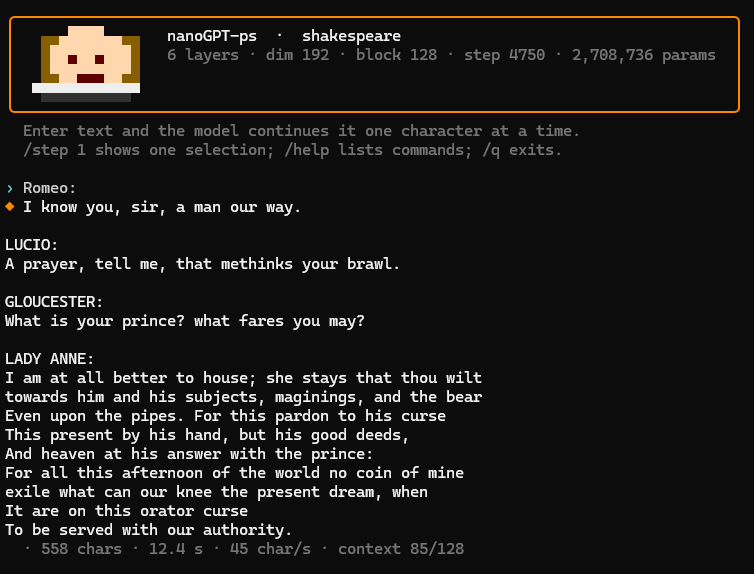

[In English: README.md](README.md)

# psgpt

Karakterszintű GPT, tisztán PowerShellben, alatta semmi. A transformer benne van a szkriptben: token- és pozícióbeágyazás, többfejű kauzális önfigyelem, GELU-s MLP, LayerNorm, kimeneti fej. A tanítóciklus is. A backpropagation kézzel van kiírva, numerikus gradienssel ellenőrizve nagyjából 1e-9 pontosságig; az optimalizáló Adam koszinuszos tanulásiráta-ütemezéssel, a mini-batch-ek párhuzamosan futnak a processzormagokon. A generálás KV-cache-t használ. Van hozzá terminálos chat is.

Azért érdekes, mert az egészet el lehet olvasni. Minden mátrixszorzás egy ciklus, amire töréspontot lehet tenni. És van a chatben egy parancs, a `/step`, amivel ezt nézni is lehet: kiadja a következő karaktert, és közben kiírja, mi történt útközben.



*A chatablak: a modell fejléce, majd egy Shakespeare-stílusú folytatás.*

## Mire jó

Beszélgetni. Beírsz egy sort, a modell folytatja abban a stílusban, amin tanult:

```
  > ROMEO:
  ◆ KING RICHARD II:
    And thou consent is so this first wivers,
    For thou art thou only to cheek the corruption,
```

Nézni, ahogy dönt. A `/step` egyetlen karaktert generál, és megmutatja hozzá a teljes menetet: a token- és pozícióbeágyazást, azt, hogy az egyes rétegek figyelme melyik korábbi karaktereket súlyozta a legjobban, aztán a végső logiteket, a softmaxot, az öt legvalószínűbb karaktert a valószínűségükkel, és hogy melyiket sorsolta ki végül. A `/step 5` ötöt csinál egymás után. Azt látod, ahogy a modell betűt választ.

Tanítani. A `nanogpt-ps.ps1 -Train` lefuttatja az előreterjesztést, a kézzel írt visszaterjesztést és az Adamot egy tetszőleges szövegfájlon (`-CorpusFile`), és menet közben súlyfájlba menti az állást. A `-GradCheck` egy apró modellen elvégzi a numerikus gradiensellenőrzést; ebből lehet elhinni, hogy a backprop tényleg jó.

## Gyors indítás

A súlyfájlok darabja kb. 57 MB, ezért nem a repóban vannak, hanem a GitHub Releases alatt. Töltsd le a `nanogpt-shakespeare-weights.json` és a `nanogpt-orban-weights.json` fájlt abba a mappába, amelyik kiadást használod.

```
cd hu          # vagy: cd en
# a két súly .json a Releases-ből ide, ebbe a mappába
pwsh ./chat.ps1 -Model shakespeare      # vagy: -Model orban
```

Írj be valamit, Enter. A chaten belül:

- `/step` vagy `/step 5`: karakterenkénti generálás a teljes bontással
- `/temp`, `/tokens`, `/topk`: mintavételi hőmérséklet, kimenet hossza, top-k levágás
- `/help`: a többi
- `/q`: kilépés

## A két modell

Mindkettő 6 rétegű, 192 széles, kb. 2,7 millió paraméteres, 128 karakteres kontextusablakkal.

A `shakespeare` a Tiny Shakespeare szövegen tanult, ez nagyjából 1 MB a drámákból. Angolul ír, színdarab formában: csupa nagybetűs szereplőnevek, sortörés ott, ahol a verssor kívánja, a szavak többnyire valódiak, néha csak majdnem.

Az `orban` magyar politikai beszédeken tanult. Amit kiad, az stílusszimuláció: kitalált mondatok a forrás ritmusával és szókincsével. Egyetlen mondata sem idézet. A modell nem őriz meg semmilyen tényleges beszédet, és nem is tudna egyet visszaadni; egyszerűen hihetően hangzó magyar szöveget rak össze karakterenként. A chat pontosan ezért jelöli meg szimulációként a kimenetét, és így is kell olvasni.

## Sebesség és határok

Lassú. Karakterszintű, interpretált, PowerShell: laptopon nagyjából 36 karakter másodpercenként, gyorsabb asztali gépen a natív könyvtárral 84 körül. Egy bekezdésre várni kell. A mellékelt méretű modell betanítása CPU-n többnapos meló.

Kicsi is. 2,7 millió paraméter és 128 karakternyi kontextus arra elég, hogy megtanulja a helyesírást, a központozást meg egy szöveg lüktetését, sokkal többre nem. Kérdésekre nem válaszol. Tekintsd egy GPT-nek, amit elejétől végéig el lehet olvasni; a generált szöveg csak bizonyíték arra, hogy amit olvastál, működik.

## Követelmények

PowerShell 7, Windowson, Linuxon vagy macOS-en. Se Python, se ML-keretrendszer, se GPU.

A `lib/MathNet.Numerics.dll` a szkriptek mellett van, és nem kötelező. Ha megvan, a generálás kb. 8-szor gyorsabb. Nélküle minden ugyanúgy megy a tiszta PowerShell-ágon.

## en/ és hu/

A repóban két példány van a kódból: az `en/` angol, a `hu/` magyar kommentekkel. A kód ugyanaz; azt a mappát válaszd, amelyiknek a kommentjeit szívesebben olvasod, és oda tedd a súlyfájlokat is.

## Licenc

MIT. A LICENSE fájl itt van a README mellett.
