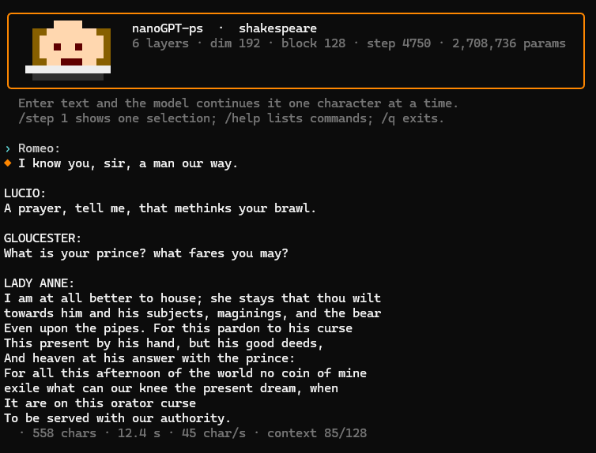

[In English: README.md](README.md)

# psgpt

Karakterszintű GPT PowerShellben, a nanoGPT alapján. Az egész transformer benne van a szkriptben, és van hozzá chatablak a terminálban.

Miért? Mert sima PowerShellen fut. Nem kell hozzá Python, semmi más.

Minden mátrixszorzás egy ciklus, amibe breakpointot tehetsz. A chatben van egy `/step` parancs is: legenerálja a következő karaktert, és kiírja, mi történt közben.




## Mire jó

Beszélgetni. Beírsz egy sort, és a modell abban a stílusban folytatja, amin tanult:

```
  > ROMEO:
  ◆ KING RICHARD II:
    And thou consent is so this first wivers,
    For thou art thou only to cheek the corruption,
```

Megnézni, hogyan dönt. A `/step` legenerál egy karaktert, és végigmutatja, hogyan jutott el odáig: a token- és pozícióbeágyazást, azt, hogy rétegenként melyik korábbi karakterre figyelt leginkább az attention, aztán a logitokat, a softmaxot, az öt legvalószínűbb karaktert az esélyükkel, és azt, amelyiket végül kisorsolta. A `/step 5` ötöt csinál egymás után.

Tanítani. A `nanogpt-ps.ps1 -Train` egy általad választott szövegfájlon (`-CorpusFile`) futtatja a forward passt, a kézzel írt backward passt és az Adamot, közben pedig menti a súlyfájlt. A `-GradCheck` egy pici modellen numerikusan ellenőrzi a gradienst, így magad is meggyőződhetsz róla, hogy a backprop jó.

## Gyors indítás

A súlyfájlok egyenként kb. 57 MB-osak, ezért nem a repóban vannak, hanem a GitHub Releases alatt. Töltsd le a `nanogpt-shakespeare-weights.json` és a `nanogpt-orban-weights.json` fájlt abba a mappába, ahol a szkripteket futtatni fogod.

```
cd hu          # vagy: cd en
# a két súly .json a Releases-ből ide, ebbe a mappába
pwsh ./chat.ps1 -Model shakespeare      # vagy: -Model orban
```

Írj be valamit, és nyomj Entert. A chatben ezek a parancsok vannak:

- `/step` vagy `/step 5`: karakterenkénti generálás a teljes bontással
- `/temp`, `/tokens`, `/topk`: mintavételi hőmérséklet, kimenet hossza, top-k levágás
- `/help`: a többi
- `/q`: kilépés

## A két modell

Mindkettő 6 rétegű, 192 széles, kb. 2,7 millió paraméteres, és 128 karakteres a kontextusablaka.

A `shakespeare` a Tiny Shakespeare-en tanult, ami nagyjából 1 MB a drámákból. Angolul ír, színdarabformában: a szereplőnevek csupa nagybetűsek, a sortörés ott van, ahol a versben lenne, a szavak többnyire valódiak, néha csak majdnem.

Az `orban` magyar politikai beszédeken tanult. Amit kiad, az stílusszimuláció: kitalált mondatok a forrás ritmusával és szókincsével, karakterenként összerakva. Egyik sem idézet, és a modell valódi beszédet nem is tud visszaadni. A chatablak ki is írja, hogy szimulációt látsz.

## Sebesség és határok

Lassú. Egy karakterszintű modell PowerShellben interpretálva laptopon nagyjából 36 karaktert ír ki másodpercenként, gyorsabb asztali gépen, a natív könyvtárral 84 körül. Egy bekezdésre várni kell. A mellékelt méretű modell betanítása CPU-n napokig tart.

Kicsi is. 2,7 millió paraméter és 128 karakternyi kontextus arra elég, hogy megtanulja a helyesírást, az írásjeleket meg a szöveg lüktetését, de sokkal többre nem. Kérdésekre nem válaszol. A lényeg az, hogy az egészet elejétől végéig el tudod olvasni.

## Követelmények

PowerShell 7, Windowson, Linuxon vagy macOS-en. Se Python, se ML-keretrendszer, se GPU.

A `lib/MathNet.Numerics.dll` a szkriptek mellett van, de nem kötelező. Ha ott van, a generálás kb. 8-szor gyorsabb. Nélküle is minden megy, csak tiszta PowerShellen.

## en/ és hu/

A kód két példányban van a repóban: az `en/` angol, a `hu/` magyar kommentekkel. Maga a kód ugyanaz. Azt a mappát válaszd, amelyiknek a kommentjeit szívesebben olvasod, és a súlyfájlokat is oda tedd.

## Licenc

MIT. A LICENSE fájl itt van a README mellett.
